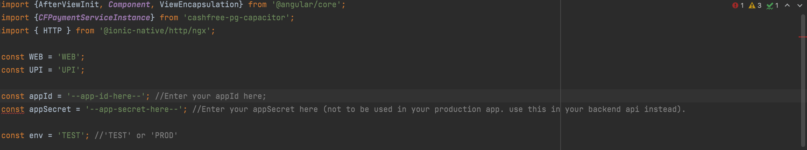

#Cashfree PG Capacitor Demo App
This demo app illustrates integration of [cashfree-pg-capacitor](https://www.npmjs.com/package/cashfree-pg-capacitor) sdk in a ionic capacitor application following the documentation [here](https://docs.cashfree.com/docs/capacitor-sdk).

##Environment
For setting up capacitor environment refer [here](https://capacitorjs.com/docs/getting-started/environment-setup)

##Setup
Enter the following command in your shell.
### Step 1 (Clone the Repo)
```shell
git clone https://github.com/cashfree/capacitor-pgsdk-demo-app.git
```
### Step 2 (Install dependencies)
```shell
npm install
```
### Step 3 (Sync project)
```shell
ionic cap sync
```

##Configure the App
* navigate to <code>src/app/home</code> and open <code>home.page.ts</code>
<p align="center">
  
</p>

* Replace **appId** and **appSecret** with the credentials from your Cashfree's account PG dashboard.

* Set the **env** as per the environment from where the credentials are used ( 'TEST' or 'PROD' ).


##Installing The App
### Android
To install the app in android run the following command.

```shell
ionic cap run android
```

### iOS
To install the app in iOS run the following command.

```shell
ionic cap run ios
```
